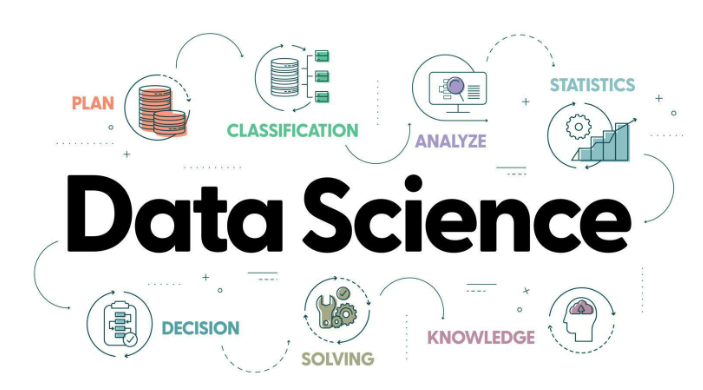

# Bootcamp de Data Science Part Time Sep 2023 

Autor: Juan Maniglia

## Descripción
Bienvenidos al repositorio del Bootcamp de Data Science. Este programa abarca desde lo más básico hasta conceptos avanzados en cuatro módulos principales:

- Ramp-Up
- Data Analysis
- Machine Learning
- Data Engineering

Las tecnologías y bibliotecas que se utilizarán incluyen Python, Markdown, Git, GitHub, numpy, pandas, scikit-learn, TensorFlow, Keras, Azure, Docker, FastAPI, Flask, PythonAnywhere, Streamlit, GitHub Actions, Power BI y PySpark.

## Contenido

- Ramp-Up:
Introducción a Python
Markdown para documentación
Uso de Git y GitHub

- Data Analysis:
Estadística básica y avanzada
Manipulación de datos con numpy y pandas
Web Scraping y APIs
Visualización de datos
Bases de datos y SQL

- Machine Learning:
Aprendizaje supervisado
Aprendizaje no supervisado
Series temporales
Deep Learning con TensorFlow y Keras

- Data Engineering:
Azure para la administración de datos
Docker para contenerización
Desarrollo de APIs con FastAPI y Flask
Despliegue con PythonAnywhere y Streamlit
Automatización con GitHub Actions
Visualización avanzada con Power BI
Procesamiento de datos con PySpark

## Requisitos

Python 3.9 o superior
Instalación de diversas bibliotecas y herramientas

## Instalación

Para instalar las dependencias necesarias, clona el repositorio y ejecuta:

## Cómo contribuir

Si deseas contribuir al repositorio, por favor realiza un _fork_ del mismo y crea una _pull request_ con tus cambios.

## Licencia

Este proyecto está bajo la Licencia MIT. Para más detalles, consulte el archivo [LICENSE](LICENSE).

## Actualizar el fork a partir del repositorio original

1. Agregar el repositorio original como "upstream":

> git remote add upstream https://github.com/JuanManiglia/DS_PT_09_2023.git

2. Obtener los cambios del repositorio original:

> git fetch upstream

3. Cambiar a la rama principal de tu fork (si no estás ya en ella):

> git checkout main

4. Combinar los cambios del repositorio original a tu rama principal:

> git merge upstream/main

5. Si es necesario, resuelve cualquier conflicto y realiza un commit con los cambios.

Con estos pasos, tu fork estará actualizado con los últimos cambios del repositorio original.

